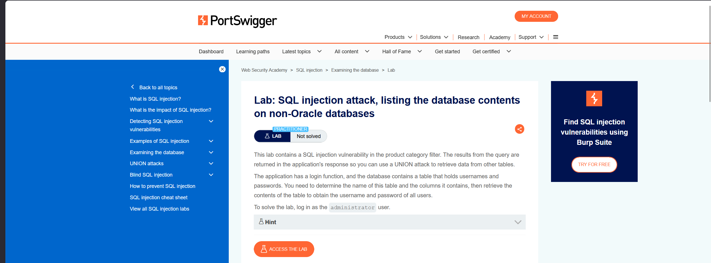
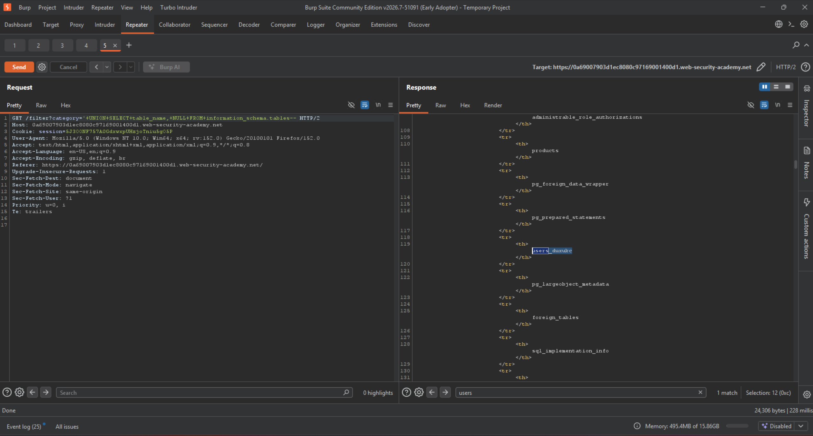
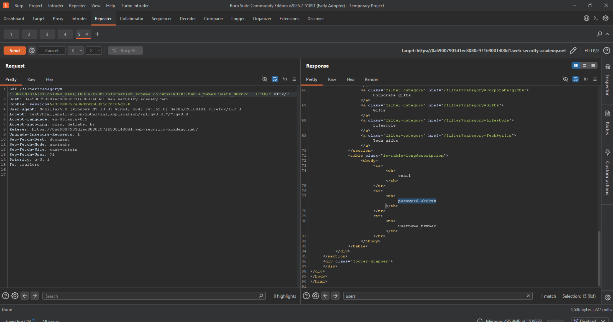
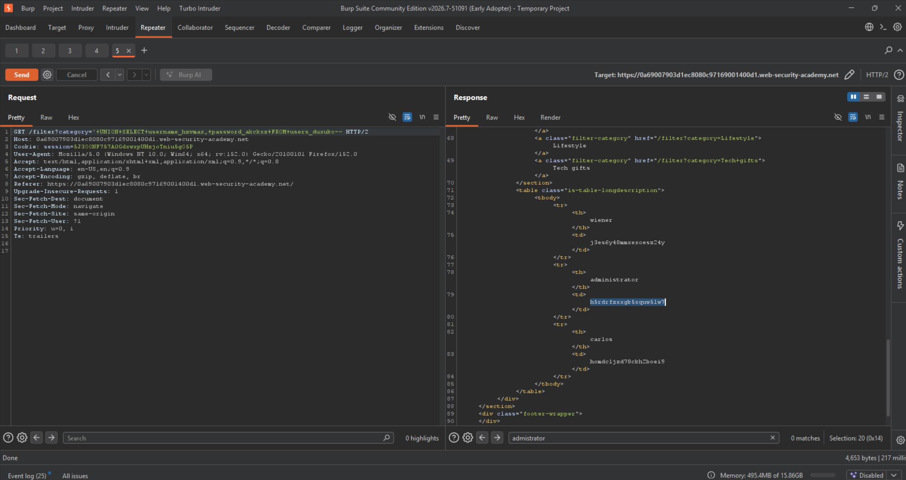
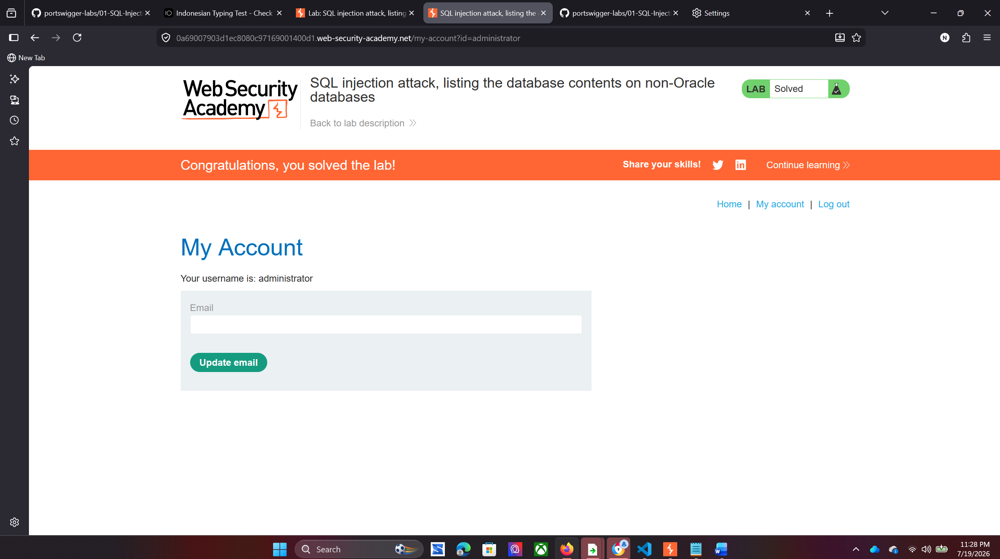

Lab: SQL injection attack, listing the database contents on non-Oracle databases

End goals:  
determine the table that contains username and password  
-output the content of the table 
-login as a administrator user 
 
 Use the following payload to retrieve the list of tables in the database:
'+UNION+SELECT+table_name,+NULL+FROM+information_schema.tables-- 
 
Use the following payload (replacing the table name) to retrieve the details of the columns in the table: 
 
Use the following payload (replacing the table and column names) to retrieve the usernames and passwords for all users and get the username and password. 
 
Now we use the username and the password to login as a administrator and BOOM we solved the Lab.

