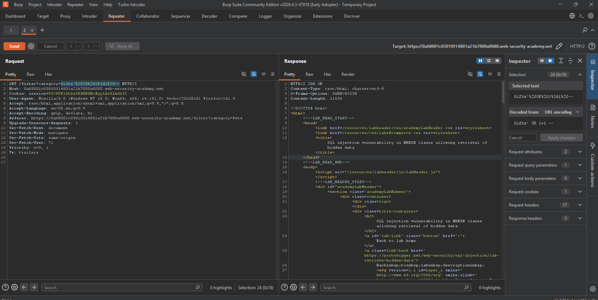

Lab: SQL injection vulnerability in WHERE clause allowing retrieval of hidden data .

.

To solve this Lab 
Use Burp Suite to intercept and modify the request that sets the product category filter.
Modify the category parameter, giving it the value '+OR+1=1--
Submit the request, and verify that the response now contains one or more unreleased products. 

