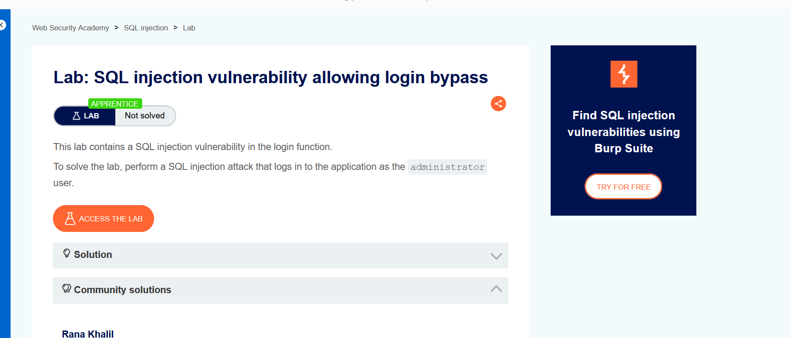
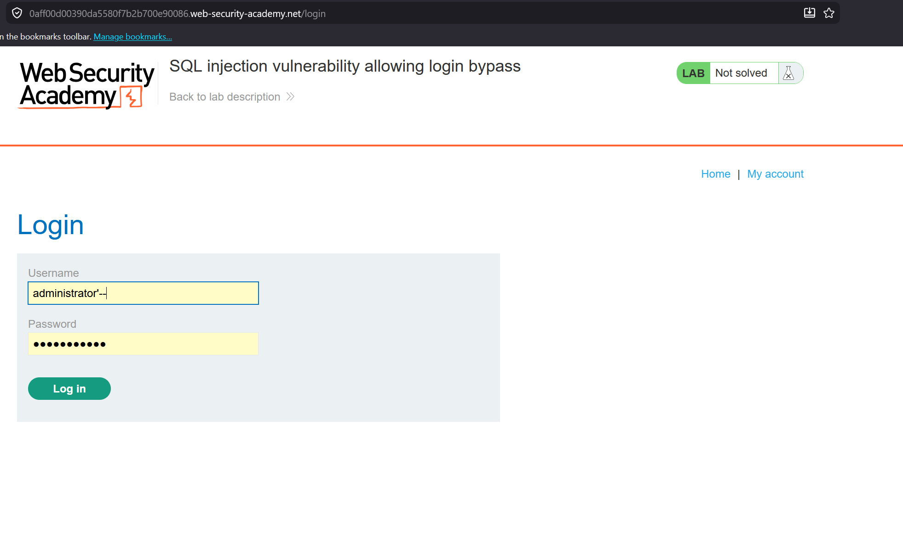
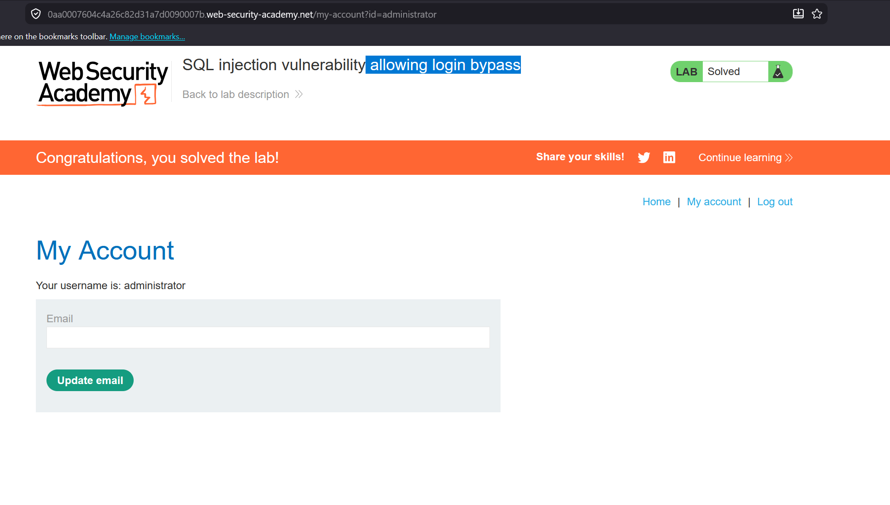

Lab: SQL injection vulnerability allowing login bypass.

so solve this lab we just Modify the username parameter, giving it the value: administrator'-- or we can use burp suite to modify the parameter
![The-username_that_we_use(image/proses02.png)]

the lab is solved
