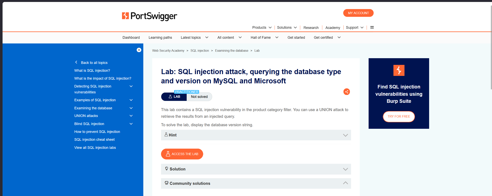
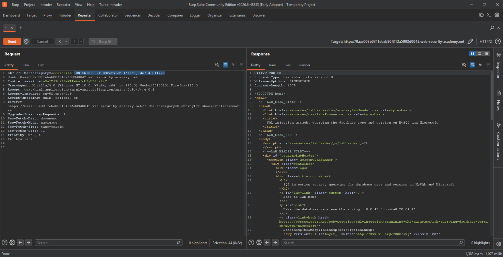
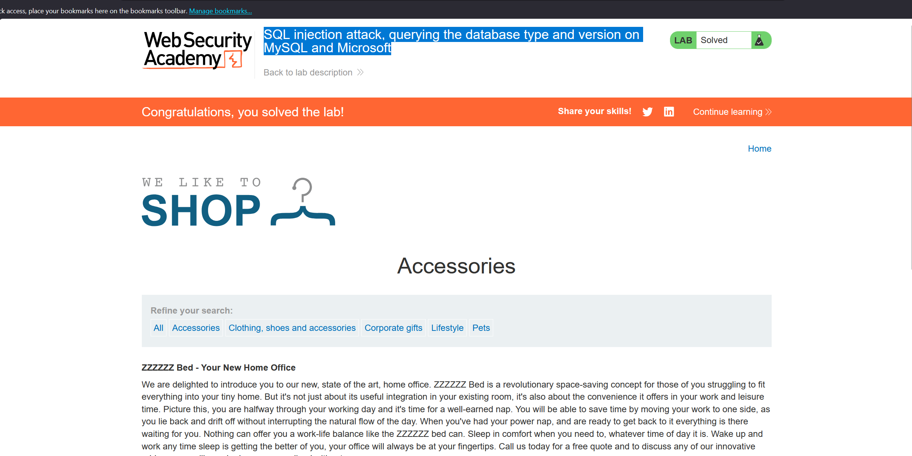

#LAB 04 : SQL injection attack, querying the database type and version on MySQL and Microsoft

 to solve this lan we Use Burp Suite to intercept and modify the request that sets the product category filter.
 Determine the number of columns that are being returned by the query and which columns contain text data. Verify that the query is returning two columns, both of which contain text, using a payload like the following in the category parameter:
 '+UNION+SELECT+'abc','def'# but we mush add @@version following database type and version.

Database version

we can query the database to determine its type and version. This information is useful when formulating more complicated attacks.

Oracle 	SELECT banner FROM v$version

SELECT version FROM v$instance,

Microsoft 	SELECT @@version,

PostgreSQL 	SELECT version(),

MySQL 	SELECT @@versio,

This Lab is Solved

