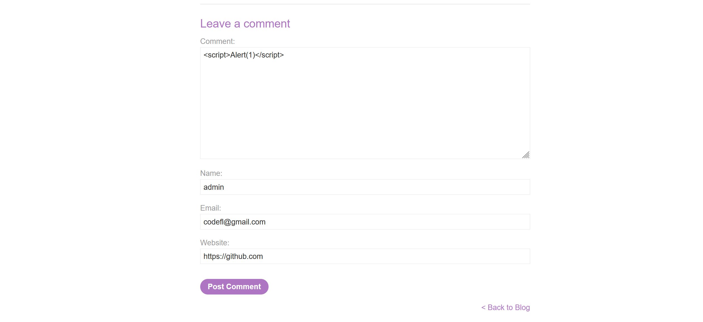
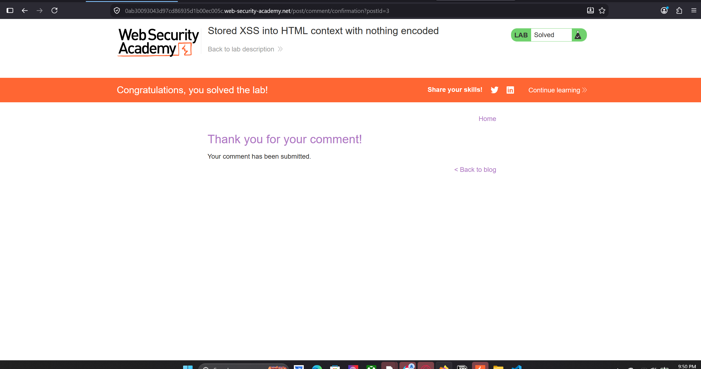

Lab: Stored XSS into HTML context with nothing encoded
 This lab contains a stored cross-site scripting vulnerability in the comment functionality.
To solve this lab, submit a comment that calls the alert function when the blog post is viewed. 
 
To solve this Lab Enter the following into the comment box:

Enter a name, email and website.
Click "Post comment".
Go back to the blog. 

Before Solve

This Lab is solved
