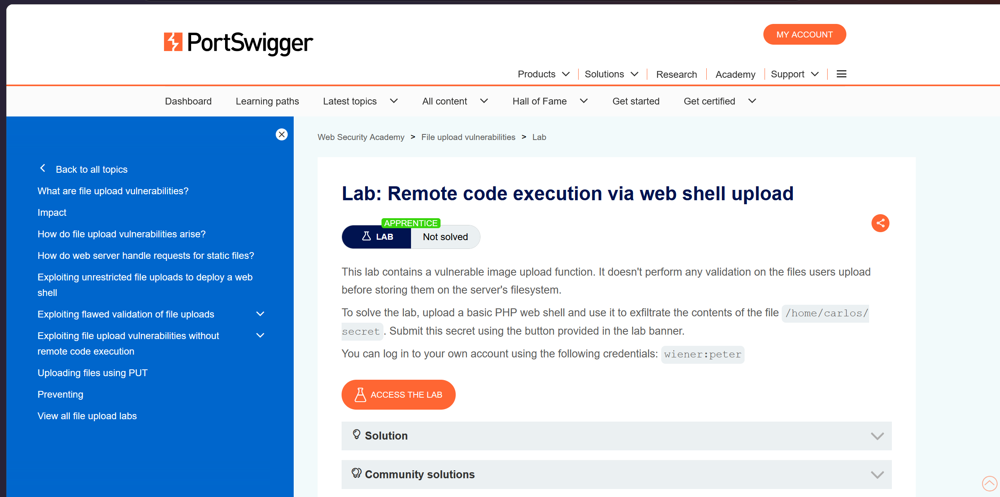
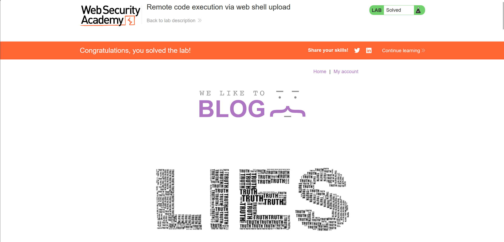

Lab :Lab: Remote code execution via web shell upload
 This lab contains a vulnerable image upload function. It doesn't perform any validation on the files users upload before storing them on the server's filesystem.
To solve the lab, upload a basic PHP web shell and use it to exfiltrate the contents of the file /home/carlos/secret. Submit this secret using the button provided in the lab banner. 
before solve the Lab.
On your system, create a file called exploit.php, containing a script for fetching the contents of Carlos's secret file. For example:
<?php echo file_get_contents('/home/carlos/secret'); ?>
Use the avatar upload function to upload your malicious PHP file. The message in the response confirms that this was uploaded successfully. 

